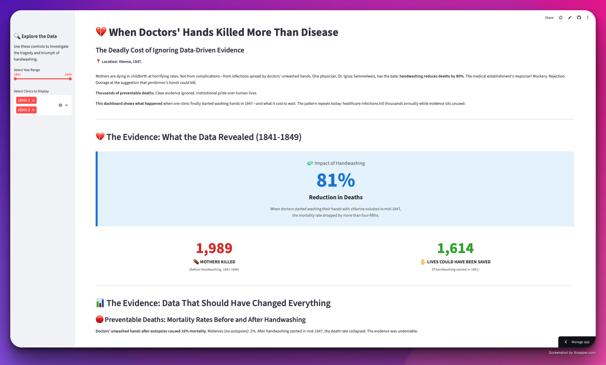
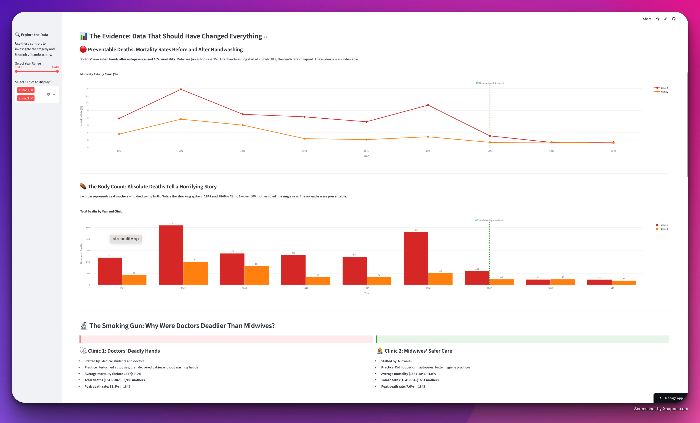
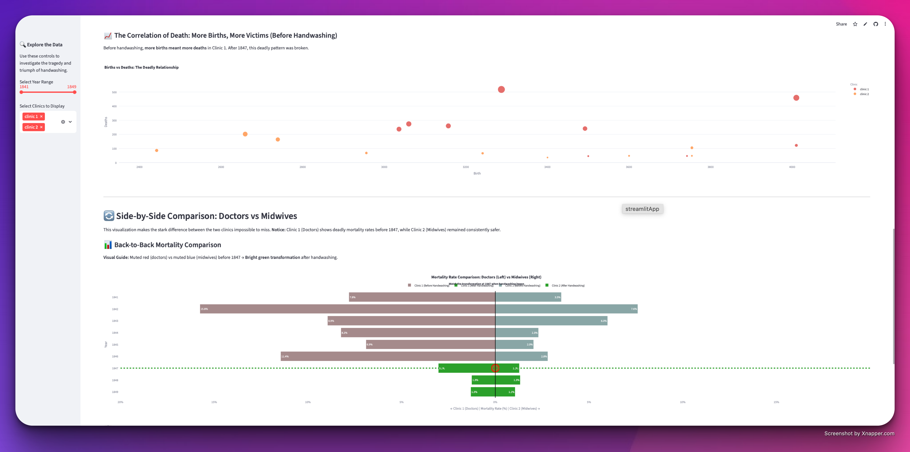

# 💔 When Doctors' Hands Killed More Than Disease
### The Deadly Cost of Ignoring Data-Driven Evidence

## 🚀 **[VIEW LIVE DASHBOARD →](https://thehandwashingrevolution1841.streamlit.app)**

---

## 🎯 The Bottom Line (TL;DR)

**Vienna, 1847.** One physician had the data: **handwashing reduces maternal deaths by 80%**.

The medical establishment's response? **Mockery. Rejection. Thousands of preventable deaths.**

**This analysis proves what the data showed 175 years ago**—and why the same patterns of bias still kill people today.

| 💀 Before Handwashing | ✅ After Handwashing | 📊 Impact |
|----------------------|---------------------|-----------|
| **9.9%** mortality | **2.0%** mortality | **80% reduction** |
| **1,989** deaths (1841-1846) | Could have saved **1,298** lives | **6 years** of inaction |

---

## 📊 Interactive Dashboard Preview



**👆 [Explore the live interactive dashboard →](https://thehandwashingrevolution1841.streamlit.app)**

<details>
<summary><strong>📸 View More Dashboard Screenshots (Click to Expand)</strong></summary>

<br>

### Section 2: Side-by-Side Comparison & Visualizations


### Section 3: Year-by-Year Data & Analysis


</details>

---

## 📊 The Data: Two Clinics, One Deadly Difference

<table>
<tr>
<th></th>
<th>🩺 Clinic 1: Doctors</th>
<th>🤱 Clinic 2: Midwives</th>
</tr>
<tr>
<td><strong>Staff</strong></td>
<td>Medical students & doctors</td>
<td>Midwives</td>
</tr>
<tr>
<td><strong>Practice</strong></td>
<td>Performed autopsies → delivered babies<br><strong>WITHOUT washing hands</strong></td>
<td>No autopsies<br>Better hygiene practices</td>
</tr>
<tr>
<td><strong>Avg Mortality (1841-1846)</strong></td>
<td>🔴 <strong>9.9%</strong></td>
<td>🟢 <strong>4.0%</strong></td>
</tr>
<tr>
<td><strong>Total Deaths (1841-1846)</strong></td>
<td>🔴 <strong>1,989 mothers</strong></td>
<td>🟢 <strong>691 mothers</strong></td>
</tr>
<tr>
<td><strong>Peak Death Rate</strong></td>
<td>🔴 <strong>15.8%</strong> (1842)</td>
<td>🟡 <strong>7.6%</strong> (1842)</td>
</tr>
</table>

**Doctors were killing mothers at 2.5× the rate of midwives.**

😢 **Mothers begged not to be admitted to Clinic 1. Some gave birth in the streets instead.**

---

## 🧪 What the Data Showed

> ### The Intervention
> **1847:** Dr. Semmelweis mandates handwashing with chlorinated lime.
>
> **Result:** Mortality drops from **9.9% to 2.0%** — **an 80% reduction.**
>
> **The medical establishment's response:** Ridicule. Career destruction. Continued deaths for decades.

---

## 🧠 Why Smart People Ignored Clear Evidence

The rejection wasn't about science. It was about **human cognitive biases**:

| Bias | What It Looked Like | Impact |
|------|---------------------|--------|
| **Pride & Ego** | "Gentlemen's hands cannot kill" | Doctors refused to admit they caused deaths |
| **Status Quo Bias** | "We've always done it this way" | Change threatened authority & expertise |
| **Authority Bias** | "He's younger and less prestigious" | Hierarchy > data |
| **Cognitive Dissonance** | Accepting truth = confronting horror | Easier to deny than face guilt |
| **Institutional Inertia** | Hospitals protected reputations | Avoided accountability at all costs |

**These weren't evil people.** They were educated professionals trapped by the same mental biases we all face.

---

## 🔍 Questions to Avoid Repeating History

### For Data Scientists & Decision-Makers

1. **Am I rejecting evidence because it threatens my identity or expertise?**
   - When data contradicts my beliefs, do I examine it objectively—or defend my position?

2. **Am I dismissing ideas based on who presents them?**
   - Do I give less weight to insights from junior team members or outsiders—even when their data is solid?

3. **Am I prioritizing comfort over truth and impact?**
   - When I see evidence of harm or inefficiency, do I speak up—or stay silent to avoid conflict?

---

## 💡 Key Takeaways

### 📈 Data Doesn't Lie—But People Ignore It
The evidence was clear: **80% reduction in mortality**. Yet pride, tradition, and resistance cost countless lives.

**Modern parallels:**
- Vaccine hesitancy despite overwhelming efficacy data
- Antibiotic resistance from overuse despite clear warnings
- Public health measures during COVID-19 rejected by those who "knew better"

### 🧼 Simple Interventions Have Massive Impact
Something as simple as **washing hands** transformed medicine. Basic hygiene saves lives **when people follow the science**.

**The lesson:** Don't overlook simple solutions because they seem too obvious or challenge existing practices.

### ⚠️ The Fight Continues
Even today, **healthcare-associated infections** kill thousands annually. Proper hand hygiene remains critical—and sometimes neglected.

**Dr. Semmelweis died in an asylum at age 47, before his ideas were accepted. His vindication came too late for the thousands who died while evidence sat unused.**

---

## 🎯 What This Project Demonstrates

**For Data Science Recruiters:**

| Skill | Evidence in This Project |
|-------|--------------------------|
| **Data Storytelling** | Transformed historical data into a narrative that connects 1847 to modern cognitive biases |
| **Statistical Analysis** | Before/after comparison, mortality rate calculations, 80% reduction quantification |
| **Visualization Design** | Interactive dashboard with clear visual hierarchy, color-coded insights, and animated indicators |
| **Python & Pandas** | Data cleaning, time series analysis, mortality rate calculations, data aggregation |
| **Streamlit Development** | Built and deployed production-ready web app with custom CSS and interactive components |
| **Critical Thinking** | Identified and articulated 5 cognitive biases that explain institutional failure |
| **Communication** | Translated complex historical/medical data into insights accessible to non-technical audiences |

**Bonus:** This project shows I can communicate complex technical concepts to non-technical stakeholders—critical for data science roles that bridge technical and business teams.

---

## 🛠️ Technical Implementation

**Tools & Technologies:**
- **Python 3.10** → Core programming language
- **Streamlit** → Interactive web application framework
- **Pandas** → Data manipulation and time series analysis
- **Plotly** → Interactive visualizations with hover details and animations

**Analysis Techniques:**
- Time series comparison (1841-1849)
- Before/after intervention analysis (pre-1847 vs post-1847)
- Mortality rate calculations and statistical comparisons
- Visual storytelling with color-coded safety indicators
- Back-to-back horizontal bar charts with gradient color schemes

**Design Philosophy:** Make the data hit hard. Numbers should make you feel the weight of preventable deaths, not just see statistics.

📊 **[View Live Dashboard](https://thehandwashingrevolution1841.streamlit.app)** | 💻 **[GitHub Repository](https://github.com/wmoore012/the_handwashing_revolution)**

---

## 📚 Data Source

**Original Dataset:** Historical mortality records from Vienna General Hospital (1841-1849)
- **Source:** Public domain historical medical records
- **Format:** CSV (`yearly_deaths_by_clinic.csv`)
- **Metrics:** Year, births, deaths, clinic assignment
- **Preprocessing:** Calculated mortality rates, standardized clinic names, handled date formatting

**Ethical Note:** This analysis uses historical data. All individuals in this dataset have been deceased for over 170 years.

---

## 💻 Run It Yourself

Want to explore the code and run the dashboard locally?

```bash
# Clone the repository
git clone https://github.com/wmoore012/the_handwashing_revolution.git
cd the_handwashing_revolution

# Install dependencies
pip install -r requirements.txt

# Launch the app
streamlit run app.py
```

**Requirements:** Python 3.10+, Streamlit, Pandas, Plotly

📦 **Dependencies:** All requirements specified in `requirements.txt`

Opens at `http://localhost:8501`

---

## 📚 Why This Project Matters

This isn't just history—it's a case study in:

✅ **Evidence-based decision making** → How data should drive action, not politics or pride
✅ **Overcoming cognitive biases** → Recognizing when our brains betray us
✅ **The human cost of ignoring data** → Every delayed decision has real consequences
✅ **Effective data storytelling** → Making numbers impossible to ignore

**For recruiters and hiring managers:** This project demonstrates the ability to:

- 📊 **Transform complex historical data** into clear, actionable insights
- 🎨 **Design visualizations** that communicate with both logic and emotion
- 💡 **Frame technical work** around human impact and real-world consequences
- 🚀 **Build production-ready applications** with modern tools and best practices
- 📖 **Tell compelling stories with data** that drive understanding and action
- 🧠 **Apply critical thinking** to identify and overcome cognitive biases

**As data scientists, we have a responsibility to present evidence clearly and push for action—even when it's uncomfortable.**

---

## 📖 The Historical Context

**Dr. Ignaz Semmelweis (1818-1865)** was a Hungarian physician who discovered that handwashing with chlorinated lime could prevent childbed fever. Despite clear evidence, his ideas were rejected by the medical establishment. He was eventually committed to an asylum, where he died at age 47—ironically, from an infection.

**His vindication came decades too late.** By the time the medical community accepted germ theory and his findings, thousands more mothers had died preventable deaths.

---

*"The time will come when great nations will find their numbers year by year diminishing... when the cradle will ask in vain for a new citizen."*
— **Dr. Ignaz Semmelweis, 1861**

---

## 📬 Let's Connect

**Interested in how I approach data storytelling and evidence-based analysis?**

- 💼 **LinkedIn:** [linkedin.com/in/wiltonmoore](https://linkedin.com/in/wiltonmoore/)
- 📧 **Email:** wmoore012@gmail.com
- 💻 **GitHub:** [github.com/wmoore012](https://github.com/wmoore012)
- 🔗 **More Projects:** [View Portfolio →](https://github.com/wmoore012?tab=repositories)

*Built for UNCC's Visual Analytics & Storytelling (DSBA 5122) with Prof. Ilieva Ageenko*

---

*In memory of Dr. Ignaz Semmelweis (1818-1865) and the thousands of mothers whose deaths could have been prevented.*

🧼 **Wash your hands. Trust the science. Save lives.**

